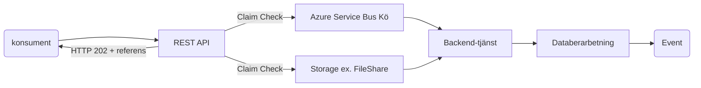

# Ökad tillgänglighet för system med servicefönster

## Problem
Ett system med ett REST API som anropas av konsumenter har servicefönster för backend-tjänsten. Systemet tar emot data från konsumenterna som ska bearbetas på något sätt, såsom ett dokument som ska arkiveras eller information om ett skadeärende som ska behandlas av systemet. Under dessa servicefönster är backend-tjänsten otillgänglig, vilket leder till att systemet inte kan hantera inkommande förfrågningar. Detta leder till förlorade eller försenade svar, vilket påverkar tillgängligheten för konsumenterna. Tillgängligheten är alltså inte tillräcklig för konsumenternas behov. 

Systemet uppfyller därför inte Afa:s 5:e arkitekturella princip: [Tjänster designas för tillgänglighet och prestanda](https://dev.azure.com/afaforsakring2/IT%20Portalen/_wiki/wikis/IT-Portalen.wiki/8710/Arkitekturens-principer?anchor=**princip-5---tj%C3%A4nster-designas-f%C3%B6r-tillg%C3%A4nglighet-och-prestanda**)

## Lösning
För att hantera problemet och öka tillgängligheten införs en mellanlagring med hjälp av en **Azure Service Bus** kö och **Claim Check Pattern**. Konsumenter kan fortsätta att skicka förfrågningar till REST API:t även under backend-tjänstens servicefönster. Informationen mellanlagras i en kö, och när backend-tjänsten är tillgänglig igen hämtar den informationen för vidare behandling.

### Steg i lösningen
1. **REST API** tar emot anrop från konsumenter. Detta API bör köras på minst två "noder" eller motsvarand för ökad tillgänglighet vid ev. uppdateringar.
2. Information från API-anrop lagras i en Azure Service Bus-kö med Claim Check Pattern, vilket innebär att endast en referens till informationen skickas i meddelandet och resten lagras på exempelvis en file share, se https://masstransit.io/documentation/patterns/claim-check. (Detta på grund av att Afa kräver i regel att vi inte hanterar känsliga uppgifter i molnet samt har uppdragsavtal om data kommer att processas i molnet).  
3. Backend-tjänsten hämtar information från Service Bus när den är tillgänglig, och bearbetar datan.
4. När backend-tjänsten har bearbetat informationen kan ett event skickas via Azure Service Bus med en referens och ev. status kring bearbetningen som gjorts.

### Komponenter
- **REST API**: Gränssnitt som konsumenter använder för att interagera med systemet.
- **Azure Service Bus**: Mellanlager för att hantera inkommande förfrågningar under backend-tjänstens servicefönster.
- **Claim Check Pattern**: Används för att lagra stora mängder data utanför meddelandet, och endast skicka en referens (claim check) genom meddelandebussen.
- **Backend-tjänst**: Systemet som bearbetar data. Har periodiska servicefönster, men använder kön för att hämta och bearbeta meddelanden när det är tillgängligt.

## Fördelar
- **Ökad tillgänglighet**: Systemet kan fortsätta ta emot och mellanlagra förfrågningar även när backend-tjänsten är offline.
- **Skalbarhet**: Azure Service Bus möjliggör att systemet kan hantera stora mängder inkommande data och köa dem för senare bearbetning.
- **Felhantering**: Vid problem med backend-tjänsten kan förfrågningar lagras säkert i kön och behandlas när tjänsten återställs.

### Illustration (mermaid)

### Illustration (Archimate)

## Referenser
Beslut https://dev.azure.com/afaforsakring2/IT%20Portalen/_wiki/wikis/IT-Portalen.wiki/8730/2022-10-12-L%C3%B6sningsm%C3%B6nster-med-asynkron-k%C3%B6hantering-f%C3%B6r-mer-robust-och-tillg%C3%A4nglig-tj%C3%A4nst
